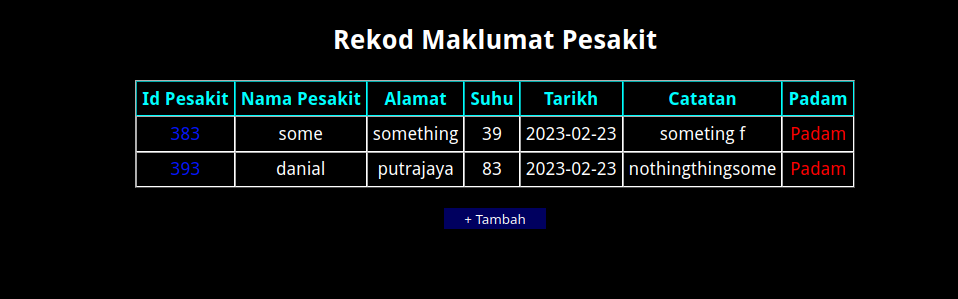
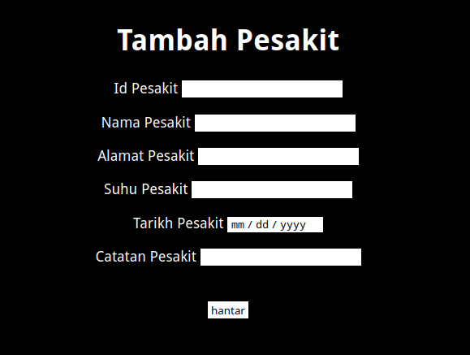
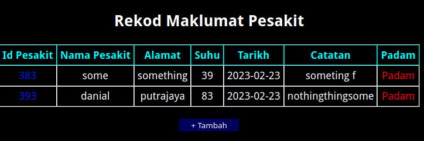
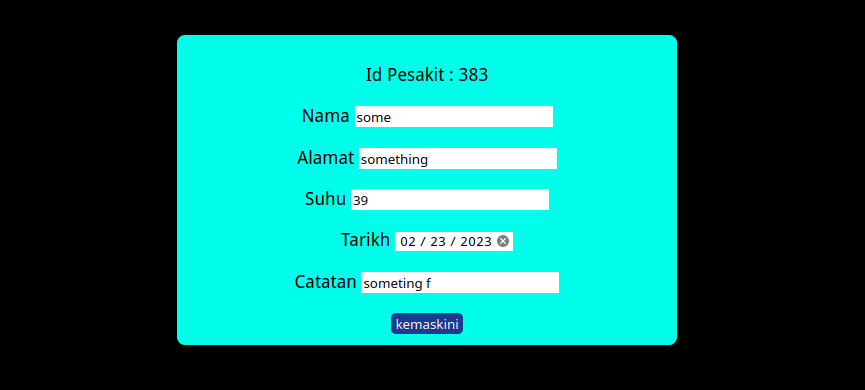

# SistemRekodPesakit
### Sistem Admin yang membolehkan admin :
- Paparkan infomasi pesakit
- Menambah infomasi tentang pesakit
- Delete pesakit
- Mengemaskini data pesakit

### Gambar

#### Paparkan infomasi pesakit :

#### Menambah infomasi tentang pesakit
- admin boleh menekan butang "+ Tambah " pada halaman utama dan akan dibawa ke tambah.php

#### Delete pesakit
- admin boleh menekan text padam untuk padam data user yang tertentu

#### Mengemaskini data pesakit
- user boleh menekan pada nombor Id Pesakit untuk mengemaskini infomasi tentang pesakit
